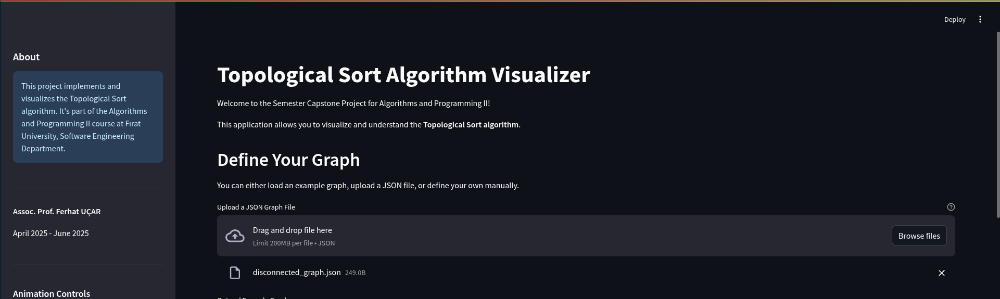
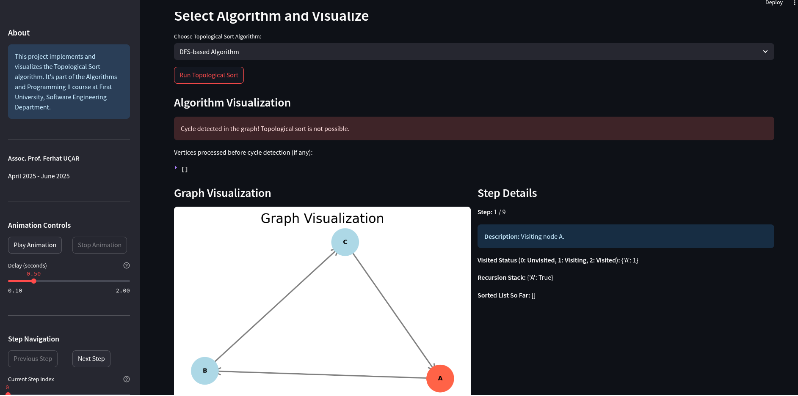

# Topological Sort - Interactive Visualization

## Project Overview
This project is an interactive web application that implements and visualizes Topological Sort, developed as part of the Algorithms and Programming II course at Fırat University, Software Engineering Department. It aims to provide a clear, step-by-step understanding of this fundamental graph algorithm.

---

## Algorithm Description

### Problem Definition
Topological Sort orders vertices of a Directed Acyclic Graph (DAG) such that for every edge U→V, U appears before V. If a cycle exists, sorting is impossible and detected.

### Mathematical Background
It operates on directed graphs (V vertices, E edges) using concepts like in-degree (incoming edges) for Kahn's algorithm, and visited states (unvisited, visiting, visited) and recursion stack for DFS-based algorithm, crucial for traversal and cycle detection.

### Algorithm Steps
#### Kahn's Algorithm (BFS-based)
1. Calculate In-degrees for all vertices.
2. Initialize a queue with vertices having an in-degree of 0.
3. Process vertices: Dequeue u, add to sorted list, decrement in-degree of u's neighbors. Enqueue neighbors whose in-degree becomes 0.
4. Cycle Detection: If not all vertices are processed, a cycle exists.

#### DFS-based Algorithm
1. Initialize vertex states: Unvisited (0), Visiting (1), Visited (2).
2. Iterate: For each unvisited vertex, start a recursive DFS.
3. DFS Recursive Step: Mark u visiting, add to recursion stack. For neighbor v: if unvisited, recurse; if visiting, cycle detected. After all neighbors, mark u visited, prepend u to sorted list.
4. Final Order: The reversed order of visited nodes forms the topological sort.

### Pseudocode
```python
# Kahn's Algorithm
function topological_sort_kahn(graph):
    in_degree = calculate_indegrees(graph)
    queue = Queue()
    sorted_list = List()
    # ...
    if num_processed_nodes != graph.num_vertices:
        return "Cycle detected, no topological sort possible."
    else:
        return sorted_list

# DFS-based Algorithm
function topological_sort_dfs(graph):
    visited_status = Map<Vertex, Int>
    recursion_stack = Map<Vertex, Bool>
    sorted_list = List()
    has_cycle = False
    # ...
    if has_cycle:
        return "Cycle detected, no topological sort possible."
    else:
        return sorted_list
```

### Complexity Analysis
- **Time Complexity**:
  - Kahn's Algorithm: O(V+E)
  - DFS-based Algorithm: O(V+E)
- **Space Complexity**:
  - Kahn's Algorithm: O(V+E)
  - DFS-based Algorithm: O(V+E)

---

## Features
- Algorithm Selection (Kahn's / DFS-based)
- Interactive Graph Input (Manual, Examples, JSON Upload)
- Dynamic Step-by-Step Visualization
- Manual Step Navigation (Previous/Next, Slider)
- Auto-Play Animation with adjustable delay
- Detailed Step Descriptions
- Automatic Cycle Detection
- Responsive User Interface

---

## Screenshots
- 
- 
- 

---

## Installation

### Prerequisites
- Python 3.8 or higher
- Git

### Setup Instructions
```bash
git clone [https://github.com/FiratUniversity-IJDP-SoftEng/algorithms-and-programming-ii-semester-capstone-project-KeremErkutf.git]
cd algorithms-and-programming-ii-semester-capstone-project-KeremErkutf

# On Windows
python -m venv venv
.\venv\Scripts\activate

# On macOS/Linux
python3 -m venv venv
source venv/bin/activate

pip install -r requirements.txt
streamlit run app.py
```

---

## Usage Guide
1. **Define Graph**: Choose an example, upload a JSON (with `{"nodes": [], "edges": []}` format), or type edges manually.
2. **Select Algorithm**: Kahn's or DFS-based.
3. **Run Algorithm**: Click "Run Topological Sort".
4. **Navigate/Animate**: Use sidebar controls to explore steps.
5. **Observe Results**: View graph, steps, and output.

### Example Inputs
- Simple DAG: `A,B\nA,C\nB,D\nC,D`
- Graph with Cycle: `A,B\nB,C\nC,A`
- Disconnected Graph: `X,Y\nP,Q\nR,S`
- Isolated Nodes: `A\nB\nC`
- Complex DAG: via `complex_dag_2.json`

---

## Implementation Details

### Key Components
- `app.py`: Main Streamlit app.
- `algorithm.py`: Graph class and algorithms.
- `utils.py`: Layout and utility functions.
- `visualizer.py`: Graph drawing and highlighting.

### Code Highlights
```python
# algorithm.py
class Graph:
    def add_edge(self, u, v):
        """Adds a directed edge and updates graph properties."""
        # ...

# visualizer.py
def draw_graph(graph_obj, current_step_data=None, pos=None):
    fig, ax = plt.subplots(figsize=(6, 3.5))
    nx.draw_networkx_nodes(G, pos, node_size=1000)
    # ...
```

---

## Testing
Run unit tests:
```bash
python -m unittest test_algorithm.py
```

### Test Cases
- Simple/Complex DAGs
- Cyclic graphs
- Empty graphs
- Single node/disconnected graphs

---

## Live Demo
A live demo of this application is available at: [YOUR_STREAMLIT_APP_URL_HERE]

---

## Limitations and Future Improvements

### Current Limitations
- No visual graph editing (drag-and-drop)
- Performance issues on large graphs
- Limited feedback for malformed input

### Planned Improvements
- Interactive graph editor
- Export graph/steps
- Alternative layouts
- Performance metrics
- Better input validation

---

## References and Resources
- Cormen et al. (2022). Introduction to Algorithms (4th ed.). MIT Press.
- Skiena, S. S. (2008). The Algorithm Design Manual (2nd ed.). Springer.
- [Streamlit Docs](https://docs.streamlit.io)
- [NetworkX Docs](https://networkx.org/documentation/stable/)
- [Matplotlib Docs](https://matplotlib.org/stable/contents.html)
- [VisuAlgo](https://visualgo.net)
- [GeeksforGeeks - Topological Sort](https://www.geeksforgeeks.org/topological-sorting/)

---

## Author
- Name: Kerem Erkut Çiftlikçi
- Student ID: 240543013
- GitHub: KeremErkutf

---

## Acknowledgements
I would like to extend my sincere gratitude to Assoc. Prof. Ferhat UÇAR for providing invaluable guidance and challenging assignments throughout this project.

This project was developed as part of the Algorithms and Programming II course at Fırat University, Technology Faculty, Software Engineering Department, Spring 2025 Semester.